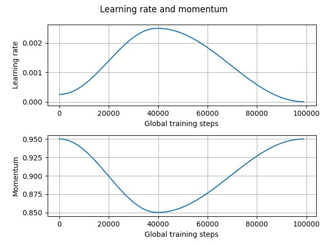
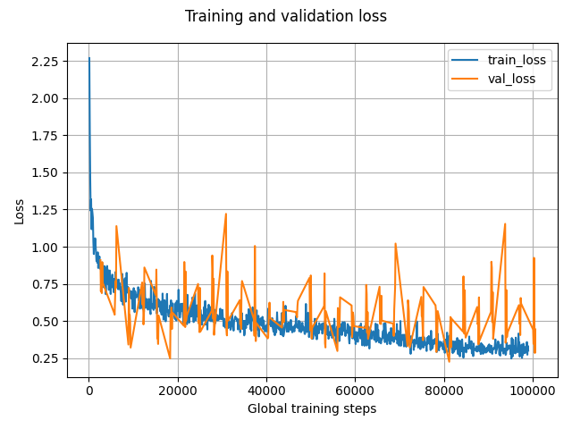

# Simple Pointpillars Pytorch Implementation
This repository originally comes from my final project of CS7643 Deep Learning course. 

This repo implements the Pointpillars model based on Pytorch for 3D object detection in autonomous driving scenarios.
It references from [mmdetection3d](https://github.com/open-mmlab/mmdetection3d), 
[OpenPCDet](https://github.com/open-mmlab/OpenPCDet), and [pointpillars](https://github.com/zhulf0804/PointPillars).


**Unlike other repositories, this implementation does not require compiling C++ or CUDA files for voxelization and 
Non-Maximum Suppression (NMS)**. While executing these steps in CPU mode may result in slower training times and 
inference speeds compared to GPU-based implementations, this performance tradeoff is acceptable for an educational 
project. Thanks to the use of Numba JIT compilation, the code remains beginner-friendly and provides an 
accessible learning experience.

This repository has been tested on Ubuntu 22.04 LTS with CUDA 12.6.

## 1. Datasets
This repo uses KITTI dataset, which can be 
downloaded [here](https://www.cvlibs.net/datasets/kitti/eval_object.php?obj_benchmark=3d). 

The data size: left camera images (12GB), point cloud data (29GB), 
camera calibration file (16MB), and training labels of the object data (5MB).
After downloading the data files, use this format to arrange all the downloaded files:

```
[project root]
    |-dataset
        |- kitti
            |- training
                |- calib (#7481 .txt)
                |- image_2 (#7481 .png)
                |- label_2 (#7481 .txt)
                |- velodyne (#7481 .bin)
            |- testing
                |- calib (#7518 .txt)
                |- image_2 (#7518 .png)
                |- velodyne (#7518 .bin)
```

## 2. Evaluation results
The pretrained model is saved
[here](https://drive.google.com/file/d/1dVO0NaZTDeP0vsAlEcqcZ83s2B1YvtS6/view?usp=sharing). After downloading it, put it
inside this folder "./model/point_pillar/checkpoints" (you need to create this checkpoints folder). 
Moreover, the training records 
in the tensorboard event files can be seen in the [summary folder](./model/point_pillar/summary).

The evaluation results are based on this pretrained model shown as follows, 
which is comparable to the [original paper's
results](https://arxiv.org/abs/1812.05784) and other implementations.

For **Easy** difficulty level:

|           Object name            |  bbox   |   bev   | 3d bbox | Average Orientation Similarity (AOS) |
|:--------------------------------:|:-------:|:-------:|:-------:|:------------------------------------:|
| Pedestrain (AP@0.50, 0.50, 0.50) | 65.3381 | 61.2155 | 53.6267 |                45.32                 |
|  Cyclist (AP@0.50, 0.50, 0.50)   | 77.9665 | 80.2129 | 77.7182 |                77.49                 |
|    Car (AP@0.70, 0.70, 0.70)     | 73.8649 | 90.1552 | 86.7099 |                73.77                 |

For **Middle** difficulty level:

|           Object name            |  bbox   |   bev   | 3d bbox | Average Orientation Similarity (AOS) |
|:--------------------------------:|:-------:|:-------:|:-------:|:------------------------------------:|
| Pedestrain (AP@0.50, 0.50, 0.50) | 61.8521 | 56.8651 | 48.6542 |                42.75                 |
|  Cyclist (AP@0.50, 0.50, 0.50)   | 63.7975 | 64.9625 | 61.5657 |                62.30                 |
|    Car (AP@0.70, 0.70, 0.70)     | 73.7402 | 87.6047 | 76.7685 |                73.20                 |

For **Hard** difficulty level:

|           Object name            |  bbox   |   bev   | 3d bbox | Average Orientation Similarity (AOS) |
|:--------------------------------:|:-------:|:-------:|:-------:|:------------------------------------:|
| Pedestrain (AP@0.50, 0.50, 0.50) | 57.7964 | 52.4085 | 44.9285 |                39.72                 |
|  Cyclist (AP@0.50, 0.50, 0.50)   | 60.3165 | 61.6014 | 58.2591 |                58.70                 |
|    Car (AP@0.70, 0.70, 0.70)     | 73.1248 | 85.3887 | 74.3094 |                72.36                 |

To run the inference, after loading to this project folder, one can simply run the follows.
```
# using default paths from ./Demo_dataset
python inference.py 

# using your assigned paths including ground truth labels
python inference.py --point_cloud_file_path your_point_cloud_file_path --image_file_path your_image_file_path  
--calibration_file_path your_calibration_file_path --label_info_file_path your_label_info_file_path

# using your assigned paths without ground truth labels
python inference.py --point_cloud_file_path your_point_cloud_file_path --image_file_path your_image_file_path  
--calibration_file_path your_calibration_file_path
```

The example data visualization can be seen in [Demo_dataset](./Demo_dataset/prediction) as follows.

For file index 114: 


For file index 134: 


## 3. End-to-end training
To run the end-to-end model training, after loading to this project folder, one can simply run the follows.
```
python main.py 
```
For the first time of the running, dataset preprocessing will be executed. After the training of
the model, the evaluation will be automatically executed, followed by a testing inference data 
based on validation dataset to show how the model
performs compared to the ground truth labels. This testing inference data comes from a random pick 
from the validation dataset.

In this repo, the PointPillar model is trained 160 Epochs with the batch size 6.

One can then simply go to tensorboard to see the records by executing the follows:
```
tensorboard --logdir=./model/point_pillar/summary
```
Then to plot of the tensorboard records, first download the data in CSV format to this folder: 
"./model/point_pillar/summary/tensorboard_data", and then execute this:
```
python plot_tensorboard_data.py --lr_path your_learning_rate_data_path --momentum_path your_momentum_path  
--train_loss_path your_train_loss_path --val_loss_path your_val_loss_path
```
The tensorboard training records in this repo is shown as follows:


